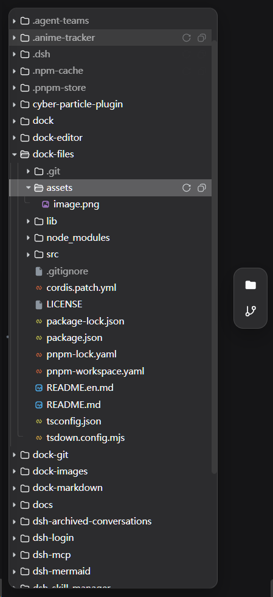
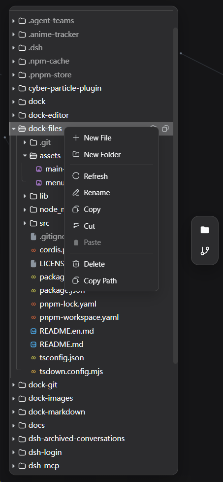

# dock-files

[中文](README.md)

> **A file explorer for DSH workspaces.** dock-files provides a VSCode-style file tree, drag-and-drop import, clipboard paste, transfer task management and context menus.

File-explorer plugin of the dock family: mounts a side-bar files panel that browses the active conversation's working directory (through its own `/wb-files` host route) and hands clicked files to the registered file viewer (e.g. dock-editor).

## Preview

| Main UI | Context menu |
| --- | --- |
|  |  |

## Features

- **Directory tree browsing**: lazy recursive expansion, directory-first case-insensitive ordering (VSCode explorer order); VSCode-style tree UI (tinted type icons, guide lines, toolbar refresh / collapse-all, hover action buttons).
- **Session scoping**: every operation is bounded by the session working directory; paths are canonicalized with realpath and must stay inside the workspace, otherwise 403.
- **File opening**: clicking a file dispatches through `ctx.files.open` to the matching file viewer (floating window).
- **Conversation path opening**: file paths in the conversation context — prose mentions in assistant replies, paths in tool cards (read/edit/bash summaries), produced files — open in the matching workbench viewer (dock-editor / dock-images / dock-markdown by extension) instead of the OS default application (`xdg-open` / `open` / `Invoke-Item`); hosts without a desktop association (containers, headless, stale IDE IPC sockets) no longer throw `path open failed`. Folders, missing paths and types without a registered viewer still fall back to the native opener.
- **File-manager operations**: the context menu carries the usual actions — new file / new folder (auto-deduped names, dropping straight into inline rename), rename (inline editing, Enter commits / Esc cancels), copy / cut / paste (copy pastes repeatedly; cut items are dimmed and the clipboard clears on paste), paste image (saves an image from the system clipboard as a file, e.g. `image.png`, auto-named and deduped by mime type; the menu item probes the clipboard and only shows when it actually holds an image), delete (confirmed, recursive, never overwrites), copy path, refresh; ordinary files can be downloaded through the context menu using the browser's download handling, while symlinks are skipped; right-clicking empty space offers root-level new / paste / paste image / refresh.
- **Drag & drop**: drop OS files into the explorer to import copies into the target directory (original names, auto-deduped, never overwrites); drag entries inside the tree onto another directory (or the empty area = root) to move them — dropping onto a file row moves into that file's parent directory (so imprecise drops still land), while moving a directory onto itself or a descendant is rejected.
- **Paste local files**: after copying files in the OS, click the panel to focus it and press Ctrl+V to import them (the browser only exposes local file content through the paste event); the paste target is the last clicked/right-clicked directory, else the root.
- **Transfer task center**: ordinary files use chunked uploads to support large-file transfers. All transfer tasks are tracked in a global in-memory center, visible in a floating window and the status bar, with aggregate progress shown at the bottom. Tasks can be paused, resumed and cancelled. Tasks are not persisted across restarts and disappear after a restart; clearing history removes task records only and does not delete files.
- **Context menu**: per-kind items for files, directories and the empty area; the menu pulls back inside the viewport when it would overflow; confirmations and notices use a theme-matching in-app dialog. Direct paste from Windows File Explorer, copying file contents, copying download links and folder downloads are not supported.
- **Localization**: all UI copy (context menu, dialogs, notices, states) follows the DSH language setting (zh/en, switching live on the `locale/change` event); default names for new files/folders follow too (`New File.txt` / `新建文件.txt`).
- **File-domain service**: provides `ctx.files` (`open` / `registerFileViewer` / `registerFileIcon`); other plugins can register their own viewers (`exts` extension match or `default` fallback) and per-extension icons (`registerFileIcon`, one plugin may register several groups) with an `icon` (tint color + optional custom SVG glyph) that the explorer renders per extension, falling back to the built-in palette for unregistered types.

## Dependencies

| Dependency | Type | Notes |
| --- | --- | --- |
| [dock](https://github.com/AKS1st/dock) >= 0.1.0 | peer (required) | workbench shell: the side-bar panel, floating windows and `ctx.workbench` come from it |
| DSH Web environment | runtime | required; client platform is Web |
| `cordis` ^4.0.0-rc.7 | peer | plugin framework (ships with DSH) |
| `react` ^18.2.0 | peer (optional) | needed for client rendering; without it the panel UI does not activate |

**Optional viewers** (browsing works without them; install one to open its file kinds): `dock-editor` (text), `dock-images` (images), `dock-markdown` (Markdown).

## Install

Requires the `dock` base plugin:

Recommended install from the npm registry:

```sh
dsh plugin --profile web add dock-base
dsh plugin --profile web add dock-files
```

Or install from GitHub (alternative):

```sh
dsh plugin --profile web add github:AKS1st/dock
dsh plugin --profile web add github:AKS1st/dock-files
```

Pair it with viewer plugins (composable, on demand): `dock-editor` (text), `dock-images` (images), `dock-markdown` (Markdown).

## Security

The host route only accepts POSTs from trusted origins (loopback / configured trustedHosts plus same-origin check), and every directory access is canonicalized with realpath and prefix-compared against the session workspace — `..` escapes, symlinks pointing outside the workspace and unrelated absolute paths are all rejected (403).

## License

MIT
